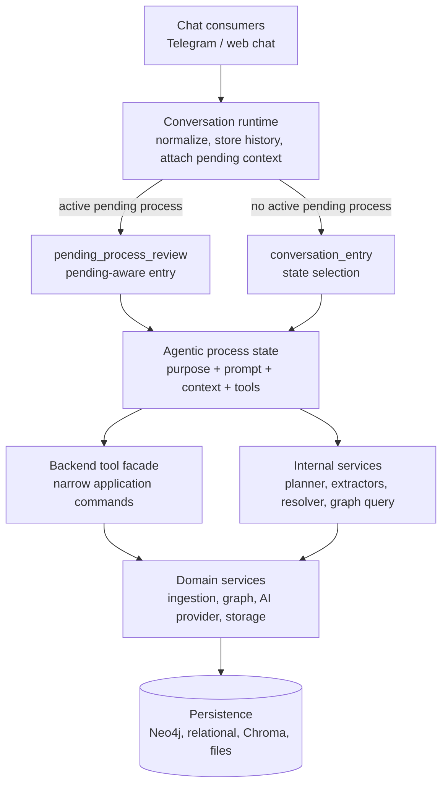
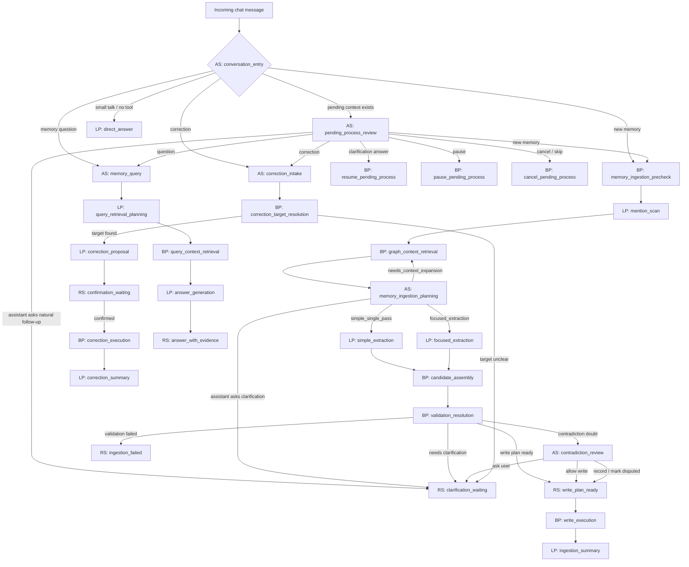
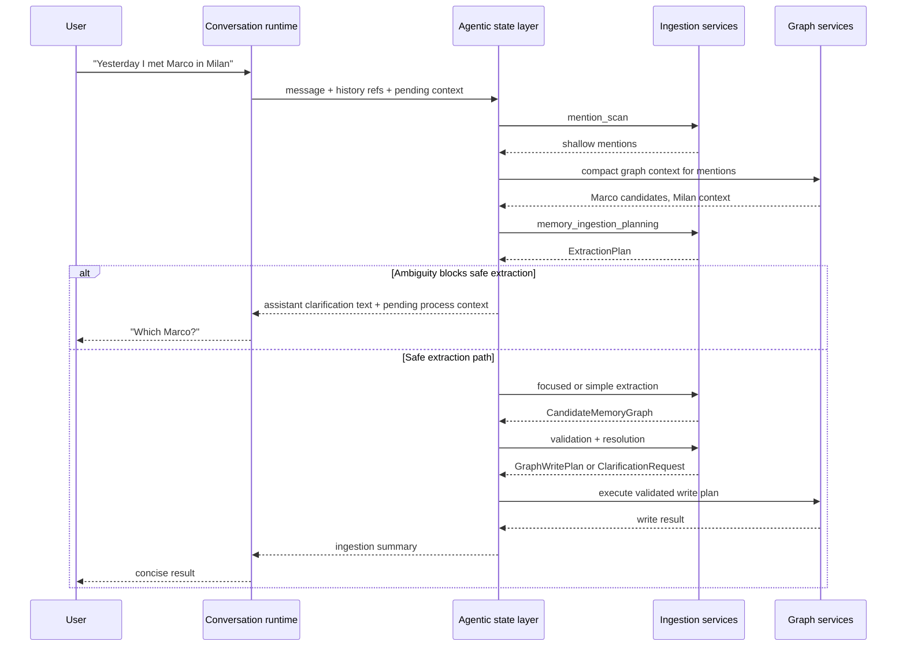

# Agentic Orchestration Architecture

## Purpose

This document defines the backend agentic orchestration design for the digital
brain. It is an architecture document, not a development plan.

The core idea is that agentic behavior is organized as **purpose-oriented
states**. Each state has a defined prompt protocol, context package, toolbox,
tool-call policy, and allowed handoff paths.

The final product goal is memory graph management. The system can achieve that
through different states: creating memories, querying memories, correcting
memories, judging contradictions, updating profile memory, or maintaining the
graph.

## Core Rule

LLMs decide actions and propose parameters. Backend services validate,
orchestrate, and execute.

Hard boundaries:

- LLMs plan extraction tasks, not graph writes.
- LLMs propose candidate objects, not persistence mutations.
- Agentic states usually respond through either an assistant message or a tool
  call. Tool arguments and tool outputs are the structured contract.
- Backend services assemble, validate, resolve, build write plans, and execute.
- Graph mutation happens only through deterministic backend services.
- Every state has a constrained toolbox.
- Prompt text is centralized and versioned; execution files import prompts by
  id/version instead of embedding long prompt bodies.

## Runtime Layers



The conversation runtime is not the agentic brain. It normalizes chat input,
stores conversation history, attaches pending process context, and calls the
agentic orchestration layer.

`conversation_entry` is the default entry state when no active process is
pending. When an active pending process exists, `pending_process_review` becomes
the preferred entry state. It can resume the pending process, keep it pending,
pause it, cancel it, or initiate a new process with the current conversation
context.

The agentic layer decides which state handles the message and which tools are
allowed inside that state.

## Agentic State Contract

An agentic state is a runtime configuration:

```text
state_id
purpose
entry conditions
system prompt / behavior protocol
required context
allowed tools
forbidden tools
tool-call policy
tool argument schemas
assistant message policy
handoff rules
user interaction policy
failure policy
expiration policy
received context
produced context
```

The same model provider can be used in different states, but each state gives it
a different job, context, and toolbox. This keeps behavior dynamic without
letting a model call do everything.

An `AS` does not always need a separate structured output object. For
orchestrator-like states, the primary output shape is:

```text
assistant message
or
tool_call(name, arguments)
```

Dedicated structured outputs belong to tool arguments, tool results, focused
`LP` calls, extraction contracts, judge decisions, and backend validation
objects. This keeps conversation natural while keeping state-changing behavior
structured and auditable.

Some `AS` states may use tools during execution and still end with a required
structured output. In that case, tools are side-effect-bounded support actions,
while the final state result is a validated schema. `memory_ingestion_planning`
is the canonical example: it may request context expansion or contradiction
review, but it must finish by producing an `ExtractionPlan` structured output.

## Execution Node Labels

The handoff graph uses explicit labels so future implementation sessions do not
confuse agentic reasoning, deterministic backend work, and waiting states.

| Label | Meaning | Example |
| --- | --- | --- |
| `AS` | Agentic state: an LLM-controlled runtime state with a purpose, prompt protocol, context package, configured tools, tool-call policy, and allowed handoffs. | `AS: memory_query` |
| `LP` | LLM procedure: a focused model call with a fixed schema and no further tool access. It returns structured data or user-facing text to its caller. | `LP: focused_extraction` |
| `BP` | Backend process: deterministic backend function or service. It may be exposed as a tool, but it does not call an LLM. | `BP: graph_context_retrieval` |
| `RS` | Runtime state: persisted waiting, confirmation, cancellation, or terminal state. It stores process status and routing context; it is not an agent. | `RS: clarification_waiting` |

Only `AS` nodes own a toolbox configuration. `LP` nodes receive a narrow input
schema and return a narrow output schema. `BP` nodes perform validated backend
work. `RS` nodes keep the chat experience natural while preserving pending
process context.

## State Handoff Graph



This graph defines allowed handoffs, not a rigid workflow engine. A pending
state enriches context, but it does not force the next user message into one
route. A later message can still be classified as a clarification answer, new
memory, question, correction, cancellation, or normal chat.

Clarification is not modeled as a broad model-visible tool. When a process
needs user input, the assistant asks a normal human-friendly question and the
runtime stores minimal `RS: clarification_waiting` context. A later user
message can resume the process only if the current state, tool call, or optional
lightweight classification indicates that it is actually a clarification answer.

## Context Handoff Matrix

Each state receives a deliberately shaped context package from the previous
runtime, agentic, LLM, or backend step. Context should be useful enough for the
state purpose, but low-noise enough to avoid distracting the model or degrading
tool-call quality.

General context rules:

- Keep raw UUIDs out of model-facing context when aliases are available.
- Include user wording and evidence spans for memory writing and answering.
- Top-level conversational states receive full usable conversation history:
  user messages, assistant messages, tool calls, and tool outputs.
- When history is too large, older turns are compacted into summaries that
  preserve decisions, unresolved questions, entity references, and user
  preferences.
- As execution moves deeper into tools or subprocesses, pass relevant parent
  history and append local tool statuses. As execution returns upward, compact
  the internal trace into one concise tool output for the caller.
- Include current interaction time and timezone when temporal reasoning matters.
- Channel/session metadata is backend-owned and may be passed to backend states
  as optional runtime context. It should not be passed directly to model-facing
  prompts for now. If a model needs channel details later, pass a deliberate
  `ChannelContextProjection`, not the raw metadata object.
- Include only task-useful metadata unless a state explicitly needs diagnostic
  details.
- Include verbose tool errors when a model is expected to recover or retry.

| Node | Receives From Previous Steps | Produces For Next Steps |
| --- | --- | --- |
| `AS: conversation_entry` | Normalized message, full usable conversation history with older compacted summaries when needed, current time/timezone, pending process summary only if relevant, optional backend-only channel metadata; no raw channel metadata in the model-facing prompt. | Assistant reply or top-level tool call with handoff parameters; may preserve, clear, pause, or defer pending process context. |
| `AS: pending_process_review` | Current message, full usable conversation history with older compacted summaries when needed, active pending process context, original pending question, pending process type/status, last relevant assistant message, current time/timezone. | Tool call to resume/start/query/correct/cancel/pause, normal assistant reply, or optional lightweight intent classification sidecar. |
| `BP: memory_ingestion_precheck` | Source text or transcript, source/media refs, pending clarification answer if resuming, current time/timezone, full usable conversation history or compacted state from the caller, backend-owned channel/session metadata. | Source context, ingestion session ref, source record refs, normalized text/transcript, source timing metadata. |
| `LP: mention_scan` | Source context, normalized text/transcript, current time/timezone, minimum history needed to interpret pronouns or follow-up wording. | Shallow mentions with kind, surface text, evidence spans, rough temporal/place/person hints; no final candidates. |
| `BP: graph_context_retrieval` | Mention scan, source context, entity/place/time hints, privacy/lifecycle filters, pending target refs when resuming. | Compact graph context: candidate entities with aliases, canonical refs, relevant relationship contexts, recent memories, source/evidence summaries, known ambiguities. |
| `AS: memory_ingestion_planning` | Source context, full usable or compacted conversation history from the caller, mention scan output, compact graph context, pending clarification answer if present, current time/timezone, prior tool outputs relevant to ingestion. | `ExtractionPlan`: execution mode, focused tasks, evidence spans, target aliases, required schemas, context expansion request, or clarification request. |
| `LP: simple_extraction` | Source context, full but compact evidence payload, task schemas selected by the plan, relevant graph aliases, temporal basis. | Candidate objects for simple low-ambiguity memories. |
| `LP: focused_extraction` | Source context, selected evidence span, one focused Pydantic contract per task, relevant graph aliases only, prior candidate refs if needed for local linking. | Focused candidate objects with evidence, original user words, missing fields, ambiguity flags, and local refs. |
| `BP: candidate_assembly` | Extraction plan, focused/simple candidates, local candidate refs, source refs, evidence refs. | `CandidateMemoryGraph` with resolved local references and grouped entity/relationship/perception candidates. |
| `BP: validation_resolution` | `CandidateMemoryGraph`, graph registries, compact graph context, source/evidence refs, resolver constraints, pending answer context if resumed. | `GraphWritePlan`, `ClarificationRequest`, contradiction doubt package, validation errors, or resolution result. |
| `AS: contradiction_review` | Proposed candidate/write intent, validator explanation of the doubt, retrieved graph context, source evidence, affected target aliases, relevant change/relationship history. | Grounded contradiction assessment and recommended action: continue, mark disputed, ask user, request more context, or fail safely. |
| `RS: clarification_waiting` | Clarification question text, reason, target refs/aliases, original source context, process/session refs, expiration timestamp. | Stored pending context for the next chat turn; no model output by itself. |
| `RS: write_plan_ready` | Validated write plan, source refs, resolution summary, optional confirmation requirement. | Write execution input or confirmation-waiting context. |
| `BP: write_execution` | Validated write plan, graph service handles, source refs, id alias map, audit context. | Write result, created/updated graph refs, change records, errors, ingestion summary input. |
| `LP: ingestion_summary` | Write result or safe failure result, user-visible affected entities, source/evidence summary, pending/clarification status. | Human-friendly assistant summary and optional structured sidecars for chat UI. |
| `AS: memory_query` | User question, full usable conversation history with older compacted summaries when needed, optional entity hints, pending context if relevant, user profile hints allowed for answering style, current time/timezone. | Query/retrieval tool call or direct response when no graph lookup is needed. |
| `LP: query_retrieval_planning` | User question, entity/time/place hints, usable conversation history or summary, optional seed aliases. | Retrieval plan: seed IDs/aliases, view type, timeline/map/neighborhood needs, evidence requirements. |
| `BP: query_context_retrieval` | Retrieval plan, graph query helpers, privacy/lifecycle filters, current time/timezone. | LLM-ready context package: target summary, current facts, relationships, affective context, timeline snippets, evidence, contradiction/merge notes. |
| `LP: answer_generation` | LLM-ready context package, user question, answer style hints, uncertainty/evidence rules. | Human-friendly answer with evidence-aware wording; no graph mutation. |
| `AS: correction_intake` | User correction text, full usable conversation history with older compacted summaries when needed, possible target hints, pending process context if relevant, current time/timezone. | Tool call to resolve target, build correction proposal, or ask a normal follow-up. |
| `BP: correction_target_resolution` | Correction text, target hints, graph context, evidence refs, candidate aliases. | Resolved target, ambiguity result, or pending clarification context. |
| `LP: correction_proposal` | Resolved target, current state/history/evidence, correction text, allowed mutation policy. | Human-readable correction proposal and confirmation request when mutation is risky. |
| `RS: confirmation_waiting` | Proposal, target refs, required confirmation text/action, expiration timestamp. | Confirmation/cancel context for the next chat turn. |
| `BP: correction_execution` | Confirmed correction proposal, target refs, graph service handles, audit context. | Applied correction result, change records, correction summary input. |
| `LP: profile_memory_extraction` | Source context, optional conversation context, owner profile summary, evidence refs, current time/timezone. | Profile memory candidates with category, value, original user words, stability, visibility, confirmation flag, or rejected observations. |
| `LP: maintenance_review` | Trigger, compact graph context, target refs, pending process summaries, current time/timezone. | Maintenance suggestions or explicit no-action reason; risky suggestions require confirmation. |

## Ingestion Orchestration

Memory ingestion is the most important orchestration branch.



Critical boundary:

```text
Planner -> ExtractionPlan
Focused extractors -> candidate objects
Assembler -> CandidateMemoryGraph
Validator/resolver -> GraphWritePlan or ClarificationRequest
Executor -> graph mutation
```

The LLM never authors the final write plan.

## Baseline Runtime Configurations

### `conversation_entry` (`AS`)

Purpose:

Select the next purpose-oriented state for a normalized user message.

Required context:

- current user message
- full usable conversation history, including user messages, assistant
  messages, tool calls, and compact tool outputs
- compacted older history summary when the conversation is too long
- current time/timezone
- pending process summary only when useful
- optional backend-only channel/session metadata

Model-facing channel rule:

For now, `conversation_entry` does not receive raw channel/session metadata in
the prompt. Future states may receive a deliberate `ChannelContextProjection`
only when channel details affect the task.

Interaction shape:

- no tool / direct answer
- `tool_call: start_memory_ingestion`
- `tool_call: query_memory_context`
- `tool_call: propose_memory_correction`

Forbidden:

- graph writes
- raw graph CRUD
- focused extraction tools
- contradiction judge mutation
- status/cancel handling as general model-visible tools

Routing contract:

```text
assistant message
or
tool_call(name, arguments)
```

There is no separate `ConversationEntryDecision` response object in the
baseline. The tool call is the structured routing decision. If the model does
not call a tool, the response is a normal assistant message.

### `pending_process_review` (`AS`)

Purpose:

Classify a new message when a pending process exists.

Entry rule:

When an active pending process exists, `pending_process_review` is the preferred
entry `AS` instead of `conversation_entry`. It decides whether the user is
continuing, abandoning, pausing, or replacing the pending process.

Interaction shape:

- normal assistant message when no process action is needed
- tool call to resume, start a new process, query, correct, cancel, pause, or
  skip
- optional lightweight intent classification when the message is ambiguous

Optional lightweight classifications:

- clarification_answer
- new_memory
- question
- correction
- cancel
- skip
- unclear
- normal_chat

Allowed tools:

- `resume_pending_process`
- `start_memory_ingestion`
- `query_memory_context`
- `propose_memory_correction`
- `pause_pending_process`
- `cancel_pending_process` only when cancellation is explicit

Forbidden:

- extraction
- graph mutation
- write-plan execution

Possible handoffs:

- `resume_pending_process`
- `memory_ingestion_precheck`
- `memory_query`
- `correction_intake`
- `pause_pending_process`
- `cancel_pending_process`

The optional intent classification is a small guardrail, not a heavy workflow
engine. It exists only to help the assistant decide whether to resume a pending
process or let the conversation continue naturally.

If the user starts a different process, the active pending process should be
cancelled or paused before the new process starts. Paused pending processes may
later be compacted into conversation history and surfaced as gentle proactive
follow-ups when that behavior is intentionally enabled.

Paused pending process notes:

- Pausing is different from cancellation. Cancellation means the process should
  not be resumed unless the user restarts it. Pausing preserves a lightweight
  unresolved question for later context.
- Paused items should be compacted into conversation history or a small pending
  backlog summary, not kept as full active workflows.
- Future proactive messages can surface paused questions gently, for example:
  "I still have one unresolved detail: when you had dinner with Marco in Milan,
  do you remember which place it was?"
- If the user cannot answer or does not care, the missing branch can be
  cancelled or stored as intentionally unresolved.
- Proactive follow-up behavior is a later design topic and should not make the
  MVP chat flow feel like a task manager.

### `memory_ingestion_planning` (`AS`)

Purpose:

Plan extraction tasks from source text plus compact graph context.

Required context:

- source text or transcript
- cheap mention scan
- compact graph context for mentions
- full usable conversation history or compacted caller-provided history
- pending clarification answer when resuming
- current time/timezone

Allowed outputs:

- `simple_single_pass`
- `focused_extraction`
- `needs_context_expansion`
- `needs_clarification_first`

Allowed tools:

- `request_graph_context_expansion`
- `request_contradiction_review`

Final output rule:

- `ExtractionPlan` is the only accepted final planner output. The planner may
  call tools while reasoning, but the final state result must be a structured
  `ExtractionPlan` validated by backend code before extraction continues.
- Backend code deterministically routes the next process step from
  `execution_mode`, `tasks`, `clarification`, and `context_gaps`.
- Free-form assistant text alone is not a valid planning result.

Clarification behavior:

- Clarification is returned as part of the `ExtractionPlan` when ambiguity
  blocks safe extraction.
- The assistant asks the user with a normal conversational message.
- The runtime stores minimal pending context so a later message can resume the
  process if appropriate.

Forbidden:

- graph write execution
- merge application
- arbitrary graph query

### `focused_extraction` (`LP`)

Purpose:

Run small schema-focused extraction tasks selected by the planner.

This is an `LP`, not an `AS`: it receives source text, evidence, schema, and
relevant aliases, then returns structured candidate objects. It has no tools and
cannot hand off to other states.

Allowed task families:

- person
- place
- event
- organization
- object
- animal
- social circle
- claim
- perception
- relationship
- relationship context
- relationship state
- metadata patch

Required context:

- source text
- selected evidence span
- task schema
- relevant graph context aliases only

Extraction parametrization:

- Each focused extraction call receives the exact structured contract for the
  task being performed.
- If the plan requires one person and one place, the backend should call the
  extractor with the person contract for the person task and the place contract
  for the place task.
- Combined extraction is allowed only as an optimization for simple inputs. The
  baseline quality rule is focused task, focused Pydantic object, focused field
  descriptions.

Forbidden:

- duplicate merge decisions
- graph write-plan creation
- graph mutation

### `validation_resolution` (`BP`)

Purpose:

Use deterministic backend services to validate candidates, resolve obvious
matches, and produce either a `GraphWritePlan` or a `ClarificationRequest`.

This is a `BP`, not an `AS`: it is backend-owned and deterministic. If it finds
a contradiction doubt that requires reasoning, it hands off to
`contradiction_review`.

Allowed services:

- candidate validation
- candidate-local reference validation
- conservative resolution
- graph write-plan construction

Forbidden:

- LLM-authored write plans
- unsafe merge execution

### `contradiction_review` (`AS`)

Purpose:

Judge a grounded contradiction doubt raised during memory writing or querying.

Required context:

- proposed candidate or write intent
- retrieved graph context
- evidence references
- agent explanation of the doubt

Allowed tools:

- read-only graph context retrieval
- source evidence lookup

Forbidden:

- direct graph mutation
- automatic user interruption for low-severity doubts

Outputs:

- result intent: `needs_context`, `needs_clarification`, `emit_verdict`, or
  `fail_safe`
- decision when a verdict is emitted: `no_conflict`, `nuance`,
  `temporal_update`, `contradiction`, or `needs_clarification`
- severity
- reason
- recommended graph action
- inspected context refs
- clarification question and resume context when user input is needed

### `memory_query` (`AS`)

Purpose:

Retrieve memory context and produce a grounded answer.

Required context:

- user question
- full usable conversation history or compacted older summary
- optional entity, place, time, or source hints
- pending process context only if relevant to the question
- allowed user profile/personality hints for answer style
- current time/timezone when freshness or timeline reasoning matters

Allowed tools:

- `query_memory_context`
- graph context package retrieval
- timeline/neighborhood/map helpers
- answer-generation provider when configured

Forbidden:

- graph mutation
- write-plan execution

### `correction_intake` (`AS`)

Purpose:

Turn a user correction into a safe proposal.

Required context:

- user correction text
- full usable conversation history or compacted older summary
- possible target hints from the current message or pending context
- current graph context when a target is likely known
- source/evidence references when the correction touches stored memory

Allowed tools:

- `propose_memory_correction`
- graph context/evidence retrieval

Forbidden:

- direct mutation without confirmation
- merge execution unless a later correction protocol explicitly allows it

Next states:

- `correction_target_resolution`
- `confirmation_waiting`
- `correction_execution`

## Agentic State Toolboxes

This section is the operational answer to: "at `AS X`, the agent can ...".
These are configured capabilities, not permission to mutate state directly.
Every tool call must still be validated by backend services before it has any
effect.

### `AS: conversation_entry`

The agent can:

- answer directly without tools when no memory operation is needed
- call `start_memory_ingestion` with source text, source references, channel
  metadata projection, and optional pending context
- call `query_memory_context` with the user question, optional entity hints,
  desired view type, and answer style
- call `propose_memory_correction` with correction text and optional target
  hints

The agent cannot:

- call graph CRUD directly
- call focused extractors directly
- execute write plans
- apply merges or lifecycle transitions directly
- call status/cancel process tools in the baseline

### `AS: pending_process_review`

The agent can:

- classify the incoming message against the active pending process
- call `resume_pending_process` when the message is a likely clarification
  answer
- call `start_memory_ingestion` when the message is clearly a new memory
- call `query_memory_context` when the message is clearly a question
- call `propose_memory_correction` when the message is clearly a correction
- call `pause_pending_process` when the user moves on but the pending question
  may remain useful later
- call `cancel_pending_process` when cancellation is explicit

The agent cannot:

- force every message into the pending process
- call extraction tools directly
- execute graph mutations

### `AS: memory_ingestion_planning`

The agent can:

- inspect source text, mention scan output, compact graph context, and pending
  clarification answers
- call `request_graph_context_expansion` when context is insufficient for a safe
  plan
- call `request_contradiction_review` when source text plus graph context raises
  a grounded ambiguity or conflict that needs judgment
- return a clarification request in the planning result when ambiguity blocks
  safe extraction
- choose the extraction mode: `simple_single_pass`, `focused_extraction`,
  `needs_context_expansion`, or `needs_clarification_first`
- return a structured `ExtractionPlan` with focused tasks and evidence spans

The agent cannot:

- produce final graph write commands
- decide non-destructive merges
- mutate graph state
- run arbitrary graph queries outside the context-expansion tool
- finish planning through unstructured assistant text alone

### `AS: contradiction_review`

The agent can:

- call `get_node_detail` for involved targets
- call `get_target_evidence` for source-backed facts
- call `get_neighborhood_view` for bounded context expansion
- call `get_change_records` for history on the involved targets
- call `get_relationship_state_history` for relationship-context evolution
- return a contradiction assessment: `no_conflict`, `nuance`,
  `temporal_update`, `contradiction`, or `needs_clarification`
- recommend a backend action, including asking the user or recording a disputed
  write

The agent cannot:

- mutate contradiction records directly
- execute write plans
- interrupt the user for low-severity doubts unless configured policy allows it

### `AS: memory_query`

The agent can:

- call `query_memory_context` for a user question
- call `get_context_package` for a seed node
- call `get_entity_detail`
- call `get_memories_involving_node`
- call `get_timeline`
- call `get_neighborhood_view`
- call `get_map_view`
- call `get_target_evidence`
- call `get_latest_contact_details`
- produce a grounded answer from retrieved context

The agent cannot:

- mutate the graph
- start ingestion unless the conversation is explicitly reclassified by
  `conversation_entry`
- expose raw arbitrary Cypher or noisy metadata to the user-facing answer

### `AS: correction_intake`

The agent can:

- call `resolve_correction_target`
- call `get_entity_detail`
- call `get_target_evidence`
- call `build_correction_proposal`
- call `request_user_confirmation` when the correction would mutate graph state

The agent cannot:

- execute the correction without confirmation
- apply merges directly
- bypass lifecycle/change-record creation

## Agentic Tool Binding Layer

State toolboxes are now backed by product-specific bindings under
`src/my_digital_brain/agentic/tools/`. The generic `ai/tools` package remains
provider-neutral and should not globally register memory-management tools.

Binding flow:

```text
AgenticStateConfig.allowed_tools
-> AgenticToolRegistry
-> build_agentic_toolbox(state_config)
-> build_agentic_tool_mapping(state_config, AgenticToolExecutionContext)
-> provider tool call
-> backend facade / graph service / proposal-only handler
-> ToolResult
```

Rules:

- A state-specific toolbox exposes only tools listed in that state's
  `allowed_tools`.
- Forbidden tools are never included in the generated toolbox.
- Missing backend dependencies return verbose `ToolResult` errors with hints.
- Mutation-like tools produce proposals, pending handoffs, or confirmation
  requests; they do not execute graph writes directly.
- `AgenticToolExecutionContext` is the dependency boundary for backend services,
  session metadata, pending process context, and history refs.

## Agentic Runtime Layer

The agentic runtime is the execution bridge between static state configuration
and provider calls.

Runtime flow:

```text
ConversationContext + AgenticToolExecutionContext
-> choose start AS
-> load AgenticStateConfig
-> load prompt template
-> build model-facing context payload
-> route model for the state
-> build state-specific ToolBox and tool mapping
-> call provider.generate_chat_with_tools(...)
-> collect compact tool events
-> inspect handoff tool output
-> continue to the next allowed state
-> compact non-interrupting specialist output back to the conversational owner
-> owner state writes the final user-visible assistant message with tools disabled
```

Start-state rule:

- If a pending process context exists, start from `pending_process_review`.
- Otherwise start from `conversation_entry`.

Top-level handoff semantics:

- In `conversation_entry` and `pending_process_review`, `start_memory_ingestion`,
  `query_memory_context`, and `propose_memory_correction` are routing commands.
  They return a handoff target and arguments.
- `query_memory_context` hands off to `memory_query`.
- `propose_memory_correction` hands off to `correction_intake`.
- `start_memory_ingestion` hands off to the ingestion backend process path.
- Specialist states execute read-only graph tools, proposal tools, or backend
  facade calls according to their state toolbox.

Tool surface ownership:

- `/status` and `/cancel` are optional deterministic developer/debug shortcuts,
  not normal user-facing product flows.
- Normal users should cancel, pause, resume, or inspect pending work through
  natural language handled by `pending_process_review`.
- `conversation_entry` model-visible tools are limited to
  `start_memory_ingestion`, `query_memory_context`, and
  `propose_memory_correction`.
- `cancel_pending_process` belongs to `pending_process_review`, where a pending
  process exists and the model can infer explicit cancellation or skip.
- `get_conversation_status` remains deterministic backend/chat behavior unless
  a later design explicitly promotes it to a model-visible tool.

The runtime does not duplicate provider tool-loop mechanics. It passes the
generated `ToolBox` and tool mapping into the AI provider, and the provider uses
the existing generic tool-call loop. Runtime responsibility is state setup,
context shaping, transition inspection, and bounded execution.

Assistant message ownership:

- User-visible owner states are:
  - `conversation_entry` for normal conversations and completed delegated
    processes;
  - `pending_process_review` when an active pending process is the entry state;
  - deterministic chat runtime handlers for optional developer/debug control
    paths such as `/status` and `/cancel`.
- Deeper states normally return compact tool outputs or context objects upward,
  not final public text.
- After `memory_query`, `correction_intake`, or a successful ingestion backend
  process completes without requiring user input, the runtime appends one
  compact tool-output summary to the owner context and runs the owner state
  again with tools disabled. The owner then writes the final assistant message.
- The main exception is clarification: a deeper state may produce a natural
  user-facing clarification question when it cannot safely continue without
  user input.
- Confirmation requests are also user-visible process interruptions. They are
  rendered by the chat layer and remain attached to the active process instead
  of being rewritten as completed top-level answers.
- These deeper clarification exchanges are inner process conversations. They
  must still be rendered and stored by the chat layer, but they remain attached
  to the active process rather than treated as a completed top-level answer.
- A contradiction-review clarification is rendered from a structured
  `needs_clarification` result, not from unstructured assistant text or a
  question-mark heuristic.
- `contradiction_review` final output is a validated
  `ContradictionJudgeResultContext` with one intent: `needs_context`,
  `needs_clarification`, `emit_verdict`, or `fail_safe`. The runtime applies
  that intent explicitly instead of inferring behavior from assistant wording.
- `memory_query`, `correction_intake`, ingestion planning, contradiction
  review, and backend processes are not final public-message owners in normal
  completion paths.

Boundaries:

- `ChatRuntime` can invoke this runtime as an opt-in `agentic` mode.
  Deterministic mode remains the default and optional deterministic `/status`
  and `/cancel` debug shortcuts are preserved without making them normal user
  UX.
- The runtime executes `AS` nodes. `BP`, `LP`, and `RS` nodes are invoked through
  backend services, structured generation services, or persisted process state.
- Nested tool/provider traces are compacted into runtime results. Parent prompts
  should receive concise tool outputs, not raw internal traces.
- The full LLM ingestion workflow runs through the ingestion service when
  configured: source normalization/transcript handling, mention scan, graph
  context retrieval, tool-enabled planning, extraction, candidate assembly,
  validation/resolution, write-plan creation, optional write execution,
  clarification, and summary.
- Ambiguity and contradiction handling are agentic behaviors. They are inferred
  from context by the relevant agentic state; the baseline should avoid brittle
  deterministic contradiction-detection rules.
- `contradiction_review` is invoked through configured tools/handoffs when
  another state or service sees an ambiguous or conflicting memory context. It
  is not a globally automatic deterministic hook.

## State And Tool Matrix

| Node | Kind | Model Role | Allowed Tools / Services | Forbidden |
| --- | --- | --- | --- | --- |
| `conversation_entry` | `AS` | Choose next state and parameters | top-level action surface, direct answer | extraction internals, writes |
| `pending_process_review` | `AS` | Classify message against pending context | resume/start/query/correction/pause/cancel commands | extraction, writes |
| `memory_ingestion_planning` | `AS` | Plan extraction tasks | context expansion, contradiction review request, structured `ExtractionPlan` output | graph writes |
| `focused_extraction` | `LP` | Produce structured candidates | focused schema input only | resolution, writes, tools |
| `validation_resolution` | `BP` | Deterministic validation and write-plan construction | validator, resolver, write-plan builder | LLM-authored writes |
| `contradiction_review` | `AS` | Judge grounded doubt | read-only graph/source tools | direct mutation |
| `memory_query` | `AS` | Retrieve and answer | query context, graph views, answer provider | mutation |
| `correction_intake` | `AS` | Propose safe correction | correction proposal, graph reads | direct mutation |
| `confirmation_waiting` | `RS` | Wait for explicit user approval | confirm/cancel/status | implicit mutation |
| `profile_memory_extraction` | `LP` | Extract durable user profile candidates | fixed schema input only | personality-cloning behavior, writes |
| `maintenance_review` | `LP` | Suggest memory maintenance actions | fixed review context only | proactive interruption, writes |

## Prompt Scaffolding

Prompt text must be centralized and versioned. Execution files should import
prompt templates by id/version and provide variables. They should not contain
long prompt bodies.

Proposed package:

```text
src/my_digital_brain/prompts/
  __init__.py
  models.py
  registry.py
  templates/
    conversation_entry/v1.system.md
    pending_process_review/v1.system.md
    clarification_classifier/v1.system.md
    memory_query/v1.system.md
    query_retrieval_planning/v1.system.md
    answer_generation/v1.system.md
    ingestion_planner/v1.system.md
    focused_extraction/person/v1.system.md
    focused_extraction/place/v1.system.md
    focused_extraction/event/v1.system.md
    focused_extraction/perception/v1.system.md
    focused_extraction/relationship_context/v1.system.md
    correction_intake/v1.system.md
    correction_proposal/v1.system.md
    contradiction_review/v1.system.md
    profile_memory_extraction/v1.system.md
    maintenance_review/v1.system.md
```

Prompt registry metadata:

```text
prompt_id
version
state_id
purpose
input_schema
output_schema
allowed_tools
model_task
privacy_notes
changelog
```

Usage pattern:

```python
prompt = prompt_registry.render(
    prompt_id="ingestion_planner",
    version="v1",
    variables={
        "source_text": source_text,
        "mention_scan": mention_scan,
        "graph_context": compact_context,
    },
)
```

This keeps prompts auditable and aligned with the operational prompt registry
already planned in the relational store.

`clarification_classifier` is optional. It should only be used when the natural
tool-call/message flow cannot confidently decide whether a user reply resumes a
pending process. It must stay lightweight and should not become a separate
clarification subsystem.

## First Implementation Slice

The first implementation should not attempt to build every state.

Recommended order:

1. Prompt registry and template loading.
2. Agentic state configuration models.
3. `conversation_entry` tool-call/message protocol.
4. `pending_process_review` tool-call/message protocol.
5. Optional lightweight pending-message intent classification.
6. Deterministic fallback router.
7. Optional LLM router using provider abstractions.
8. Integration point between `ChatRuntime` and the agentic state layer.

The ingestion planner, mention scan, focused extractors, assembler, validator,
resolver, and executor already belong to the ingestion package. The agentic
layer configures and coordinates those capabilities; it should not duplicate
them.
