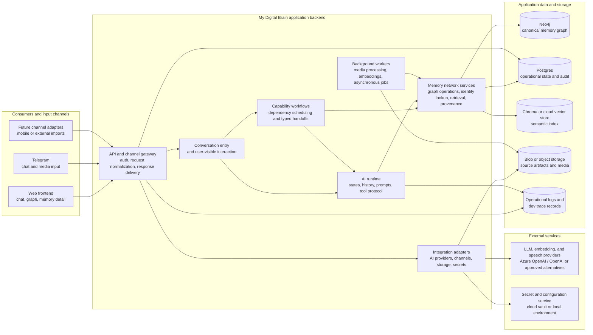

# System architecture

## Purpose

This is the high-level deployment and component boundary for My Digital Brain.
It shows consumers, the application backend, internal responsibilities, and
the external services the application can use. It is intentionally independent
of specific Python modules, provider SDK payloads, tool schemas, and workflow
step detail.

## Baseline architecture

## Component responsibilities

| Boundary | Responsibility | Does not own |
| --- | --- | --- |
| Consumers | Collect user input and render user-safe chat, clarification, graph, and memory views. | Domain decisions, provider transcripts, or direct database access. |
| API and channel gateway | Authenticate where applicable, normalize channel input into application requests, deliver responses, and expose user-safe activity/clarification packets. | Agent routing policy, graph mutation rules, or provider-specific transcript handling. |
| Conversation entry | Interpret the current user interaction and invoke the appropriate capability through configured tools. | Low-level graph writes or channel-specific persistence logic. |
| Capability workflows | Schedule known state dependencies, pass typed compact results and reference context, and own approved parallelism. | Semantic LLM decisions, provider loops, or generic action-plan execution. |
| AI runtime | Execute agentic states, manage local/provider history, render prompts, invoke tools, and preserve provider tool-call continuation. | Graph persistence, database IDs, or product-specific workflow policy. |
| Memory network services | Own graph queries and writes, identity lookup evidence, provenance, retrieval hydration, and domain validation. | Provider-native objects or model-authored database operations. |
| Background workers | Run explicitly queued, asynchronous work such as media transcription, embedding refresh, and approved maintenance jobs. | User-facing conversational continuation. |
| Integration adapters | Translate between application DTOs and external APIs, channels, storage systems, or secret providers. | Application workflow and domain behavior. |

## Data ownership

- **Neo4j** is the canonical connected-memory store: domain nodes,
  relationships, evidence links, and memory-oriented graph structures.
- **Postgres** stores operational application data: users/owners when
  introduced, chat records, durable continuation records, provider-safe request
  diagnostics, job state, audit information, and references to external data.
- **Vector storage** is an index only. Retrieval hydrates vector hits through
  graph/domain services before they are used as memory context.
- **Blob/object storage** holds raw source artifacts and media. Transcripts,
  captions, and other derived artifacts preserve a link to their original
  source.
- **Logs and dev traces** are diagnostic records, not a source of truth and not
  a user-facing memory store.

## Provider and secret boundary

The application calls AI providers only through provider adapters. Providers
receive the approved prompt, model-facing context, tool declaration, or media
artifact required by the specific request; they do not receive direct database
access or backend-only identifiers.

Secrets are supplied outside source control. Local development may use the
application environment; hosted deployments may use a managed secret store.
Both modes provide the same configuration boundary to the application.

## Deployment posture

The conceptual layout supports both local and hosted execution:

- **Local development:** frontend and backend run locally; Neo4j, Postgres,
  Chroma, and optional object storage may run as local services or containers;
  provider credentials come from the local environment.
- **Hosted deployment:** backend and workers run as deployable services; data
  stores and object/secret services may be managed; channel adapters receive
  authenticated public traffic.

The deployed topology may change without changing the component ownership shown
above.

## Related documentation

- [Architecture overview](overview.md)
- [Deterministic agentic workflows](deterministic-agentic-workflows.md)
- [Provider integration boundary](../ai-engineering/providers/provider-integration-boundary.md)
- [External integrations](../external-integrations/README.md)
- [Graph model](../network/graph-model.md)
- [Vector retrieval and indexing](../network/vector-retrieval.md)
